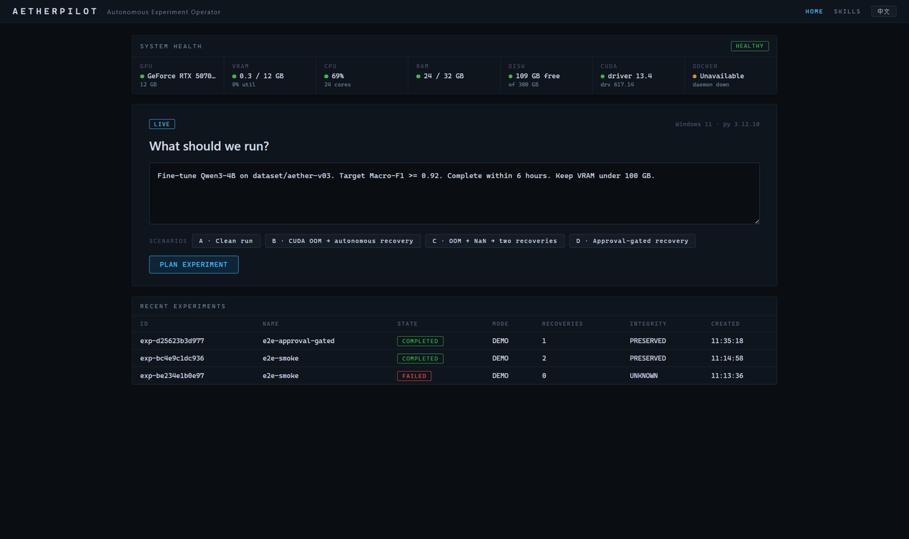
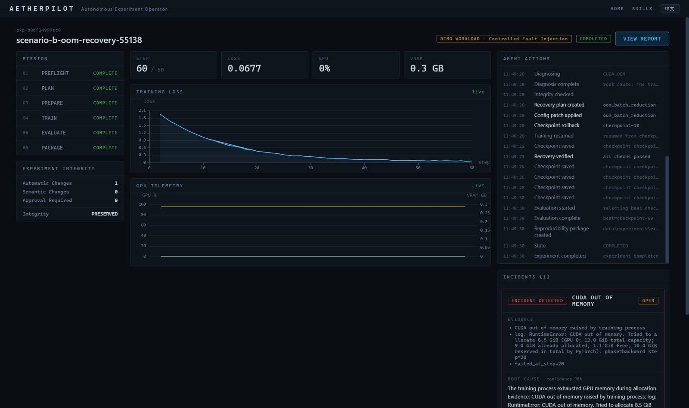
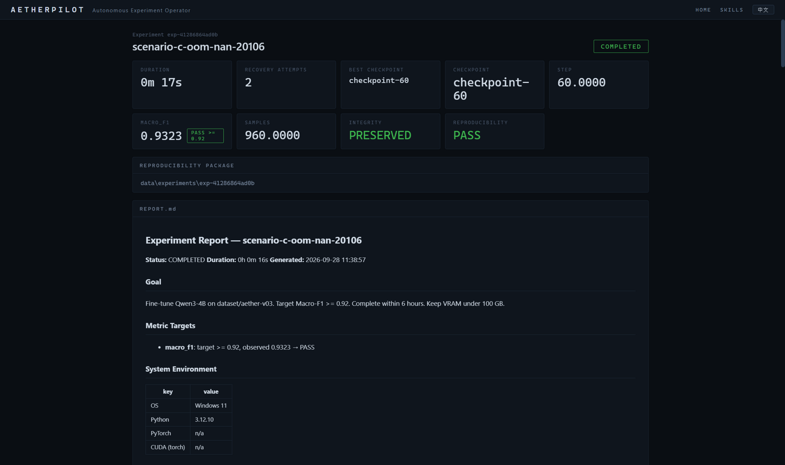

<div align="center">

# AetherPilot

**Autonomous AI Experiment Operator** — an agent that takes responsibility for a complete experiment, not just an answer about it.

_From failed run to reproducible result._
_让 Agent 对一次实验负责，而不仅仅是回答一个问题。_

[](https://github.com/lizuyi-6/AetherPilot-/actions/workflows/ci.yml)
[](LICENSE)
[](backend/requirements.txt)
[](frontend/package.json)
[](backend/requirements.txt)
[](frontend/tsconfig.json)



</div>

---

## Table of Contents

- [What it does](#what-it-does)
- [Why it exists](#why-it-exists)
- [Architecture](#architecture)
- [Agent Skill design](#agent-skill-design)
- [Experiment Contract](#experiment-contract)
- [Safety model](#safety-model)
- [Demo](#demo)
- [Getting started](#getting-started)
- [Configuration](#configuration)
- [API reference](#api-reference)
- [Reproducibility package](#reproducibility-package)
- [Development](#development)
- [Roadmap](#roadmap)
- [Contributing](#contributing)
- [License](#license)

## What it does

AetherPilot owns an AI experiment end-to-end, like an on-call infrastructure engineer would:

```
understand goal → contract → preflight → plan → launch → monitor → detect
→ diagnose → integrity check → patch config → checkpoint rollback → resume
→ verify → evaluate → reproducibility package
```

Without skills, an agent can only say *"you hit CUDA OOM, try lowering batch size."*
With AetherPilot, the agent detects the OOM, collects evidence, plans a
semantics-preserving fix (`batch 32→8 × grad_accum 1→4`, effective batch unchanged),
verifies experiment integrity, applies the patch, rolls back to the last checkpoint,
resumes training, **verifies the recovery actually worked** — then finishes the
experiment and ships a reproducibility package.

## Why it exists

Long-running GPU experiments fail in boring, well-understood ways — OOM, NaN loss,
crashes, disk pressure — usually at 3 AM. The knowledge to fix them is standard HPC
practice: exactly the kind of *professional skill* an agent should carry as a package,
not improvise from a prompt.

AetherPilot is built for single-node AI workstations such as **NVIDIA DGX Spark**
(Linux-first, all hardware discovered at runtime — nothing hardcoded).

## Architecture

```
┌──────────────────────────────────────────────────────────────────┐
│ Vue 3 + TypeScript + ECharts   (Mission-Control UI, WebSocket)   │
├──────────────────────────────────────────────────────────────────┤
│ FastAPI  REST + WebSocket                                        │
│                                                                  │
│  Agent Orchestrator (explicit state machine, persisted)          │
│    CREATED→CONTRACTING→PREFLIGHT→PLANNING→PREPARING→RUNNING      │
│    →MONITORING→INCIDENT→DIAGNOSING→RECOVERY_PLANNING→RECOVERING  │
│    →EVALUATING→PACKAGING→COMPLETED   (+ WAITING_APPROVAL)        │
│                                                                  │
│  LLM Reasoning (optional, OpenAI-compatible)                     │
│    goal parsing · incident explanation · report summary          │
│  ── never executes, never decides permissions ──                 │
│                                                                  │
│  Deterministic core (no LLM involved):                           │
│    Experiment Contract · CommandPolicy · PathGuard ·             │
│    IntegrityGuard · Incident Detectors · Recovery Planner ·      │
│    Checkpoint Discovery · Telemetry Collectors                   │
│                                                                  │
│  Skill Package: skills/hpc-experiment (SKILL.md + skill.yaml +   │
│  policies + detectors + schemas + evals)                         │
├──────────────────────────────────────────────────────────────────┤
│  psutil · pynvml/nvidia-smi · asyncio subprocess (argv, no shell)│
└──────────────────────────────────────────────────────────────────┘
```

**The LLM is not a single point of failure.** Detection, permissions, contract
enforcement, config diffs, integrity classification, monitoring, and checkpoint
selection are all deterministic. With no LLM configured, a rule-based reasoner still
runs the full pipeline; the LLM only upgrades natural-language understanding and
explanations when present.

## Agent Skill design

A **tool** knows how to run `nvidia-smi`. A **skill** knows when memory matters, what a
backward-phase VRAM spike means, which fixes preserve the experiment's scientific
meaning, and how to prove the fix worked.

`skills/hpc-experiment/skill.yaml` declares ten capabilities — preflight, estimation,
planning, launching, monitoring, diagnosis, safe recovery, checkpoint management,
evaluation, reproducibility audit — each mapped to its runtime implementation, with
policies, detectors, recovery strategies, schemas, and eval cases:

```
skills/hpc-experiment/
├── SKILL.md                  # human-readable skill definition
├── skill.yaml                # capabilities → runtime modules, permissions, detectors
├── policies/                 # permissions.yaml, integrity.yaml
├── schemas/                  # incident.schema.json, recovery.schema.json
└── evals/                    # oom_case.json, nan_case.json
```

## Experiment Contract

Every experiment starts from a contract that bounds what the agent may do:

```yaml
constraints:   { max_vram_gb: 100, max_duration_hours: 6, max_disk_gb: 500 }
permissions:
  restart_training: true
  modify_training_config: true        # false → recovery plans wait for human approval
  install_system_packages: ask
  kill_external_processes: false      # hard-denied, not supported
  delete_user_files: false            # hard-denied, not supported
metrics:       { macro_f1: { target: 0.92, operator: ">=" } }
recovery:      { allow_checkpoint_rollback: true, max_auto_recovery_attempts: 3 }
```

## Safety model

- **CommandPolicy** — every command is an argv list (never `shell=True`), classified
  `READ_ONLY / SAFE_WRITE / PRIVILEGED / FORBIDDEN`; forbidden patterns (`rm -rf /`,
  `mkfs`, fork bombs, shutdown) are rejected outright.
- **Workspace jail** — all writes are confined to `data/experiments/<id>/`; read paths
  must be granted and are `resolve()`-checked against traversal.
- **IntegrityGuard** — classifies every config change.
  *Semantics-preserving* changes (batch↓ × grad-accum↑ keeping effective batch,
  gradient checkpointing, LR decrease after instability) run autonomously.
  *Semantic* changes (dataset/model/metric/objective, effective-batch changes, LR
  increases) require **human approval**.
- **Audit trail** — every autonomous change is logged with who/what/why/evidence/policy.
- **No fabrication** — telemetry is real (pynvml / nvidia-smi / psutil). No GPU →
  the UI honestly shows `GPU UNAVAILABLE` and offers Demo Mode.

## Demo

### Real mode

Runs against the live host: real `nvidia-smi`/pynvml telemetry, real processes.
Point the training config at a real workload command (HuggingFace Trainer integration
is on the roadmap).

### Demo mode

`demo/training_workload.py` is a **real Python process** with real logs, real
checkpoint files, and **controlled fault injection** (clearly labeled `DEMO WORKLOAD`
in the UI):

- `--inject-oom-at-step 20 --oom-if-batch-size-above 16` — OOM fires only while the
  batch size actually exceeds the threshold, so the agent's batch reduction
  genuinely fixes it.
- `--inject-nan-at-step 45 --nan-if-lr-above 1.8e-5` — NaN fires only while LR is
  too high, so the agent's LR reduction + gradient clipping genuinely fixes it.

Built-in scenarios (dashboard chips):

| # | Scenario | What you watch |
|---|----------|----------------|
| A | Clean run | Preflight → train → evaluate → package |
| B | CUDA OOM | Detect → diagnose → `batch 32→8, accum 1→4, grad-checkpoint on` → rollback → resume → verify |
| C | OOM + NaN | Two autonomous recoveries; integrity stays PRESERVED |
| D | Approval-gated | Contract forbids autonomous config changes → agent waits for your approval |

### Screenshots

| OOM incident — evidence, config diff, recovery | Completed run — evaluation + REPORT.md |
|---|---|
|  |  |

## Getting started

**Requirements:** Python 3.11+, Node.js 20+. No Docker required for development.

```bash
git clone https://github.com/lizuyi-6/AetherPilot-.git
cd AetherPilot-

# Linux / macOS
make setup        # python venv + backend deps + frontend deps
make dev          # backend :8000 + frontend :5173 (proxied)

# Windows
scripts\setup.ps1
scripts\dev.ps1
```

Then open [http://localhost:5173](http://localhost:5173) and click a scenario chip.

```bash
make demo         # headless: run scenario C (OOM + NaN recovery) via the API
make test         # backend unit tests
```

Docker (all-in-one):

```bash
docker compose up --build
```

## Configuration

| Environment variable | Default | Purpose |
|---|---|---|
| `AETHER_PORT` | `8000` | Backend port |
| `AETHER_DATA_DIR` | `./data` | Workspaces, SQLite, telemetry |
| `AETHER_LLM_BASE_URL` | — | OpenAI-compatible endpoint (vLLM, Ollama, cloud) |
| `AETHER_LLM_API_KEY` | — | API key |
| `AETHER_LLM_MODEL` | — | Model name |
| `AETHER_DEMO_GPU_GB` | `12.0` | Virtual VRAM ceiling for demo-mode OOM injection |

Without LLM variables the system runs fully on the rule-based reasoner.

## API reference

```
GET  /api/system/status          live host/GPU/CUDA/Docker probe
GET  /api/system/telemetry       telemetry ring buffer
GET  /api/skills                 installed skill packages
GET  /api/scenarios              demo scenario presets A–D
POST /api/experiments            create (free-text goal → contract)
GET  /api/experiments/{id}       detail incl. integrity counters
POST /api/experiments/{id}/start | stop
GET  /api/experiments/{id}/incidents | events | approvals
POST /api/experiments/{id}/approval/{approval_id}   {"decision": "approve"|"reject"}
GET  /api/experiments/{id}/report        REPORT.md
GET  /api/experiments/{id}/package       manifest + workspace path
WS   /ws/experiments/{id}        live event stream
WS   /ws/system                  live telemetry stream
```

Interactive docs: [http://localhost:8000/docs](http://localhost:8000/docs) when the
backend is running.

## Reproducibility package

Every completed experiment writes `data/experiments/<id>/`:

```
manifest.yaml  contract.yaml  environment.json  dataset.sha256  workload.sha256
configs/{original,current,final}.yaml
telemetry/{gpu,system}.jsonl
incidents/*.json
evaluation/results.json
audit.jsonl  timeline.jsonl  logs/training.log
REPORT.md
```

## Development

```
backend/   FastAPI app (agent, contracts, incidents, recovery, integrity,
           training, telemetry, reproducibility)
frontend/  Vue 3 + TS + Vite + Pinia + ECharts
skills/    hpc-experiment skill package
demo/      demo training workload + dataset
scripts/   setup / dev / demo entry points
```

```bash
# unit tests (contract, command policy, path jail, integrity, parser,
# checkpoints, detectors, recovery, state machine, reasoner)
pytest backend/tests --ignore=backend/tests/e2e_smoke.py --ignore=backend/tests/e2e_approval.py

# E2E against a running backend
python backend/tests/e2e_smoke.py      # full OOM+NaN slice
python backend/tests/e2e_approval.py   # approval-gated recovery

# frontend type-check + build
cd frontend && npm ci && npx vue-tsc --noEmit && npm run build
```

CI runs the backend tests and the frontend type-check/build on every push.

## Roadmap

- HuggingFace Trainer / real-model adapter
- Docker runner with NVIDIA Container Runtime isolation
- Additional failure modes: dataloader stalls, throughput regression, flaky GPU
- Multi-experiment scheduling, experiment comparison views
- Resume of in-flight experiments after backend restart (state is already persisted)
- SLURM / multi-node support — explicitly out of scope for v1

## Contributing

Issues and pull requests are welcome. Please run the backend unit tests and the
frontend type-check before submitting (`make test` and `npx vue-tsc --noEmit`), and
keep new agent behavior deterministic-first: LLM output must never flow directly into
command execution or permission decisions.

## License

[MIT](LICENSE)
